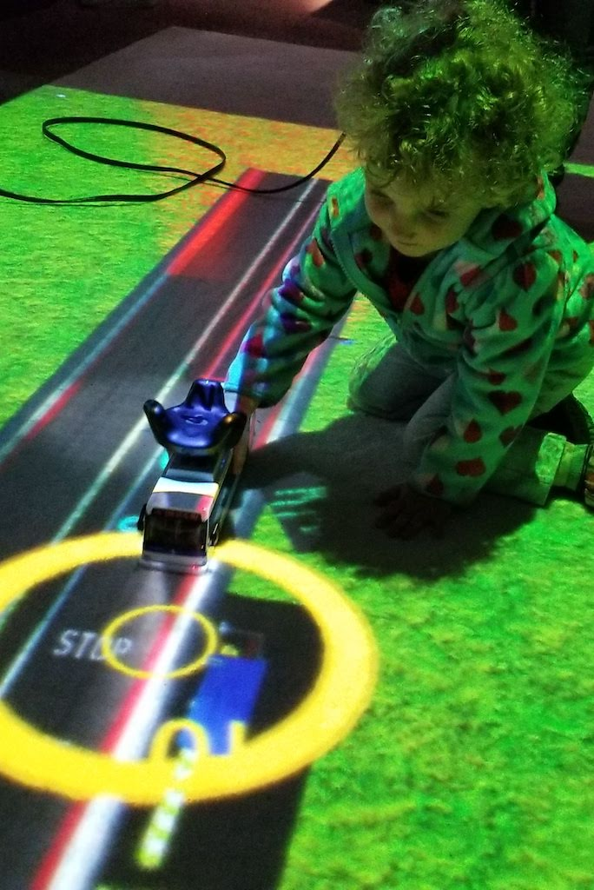
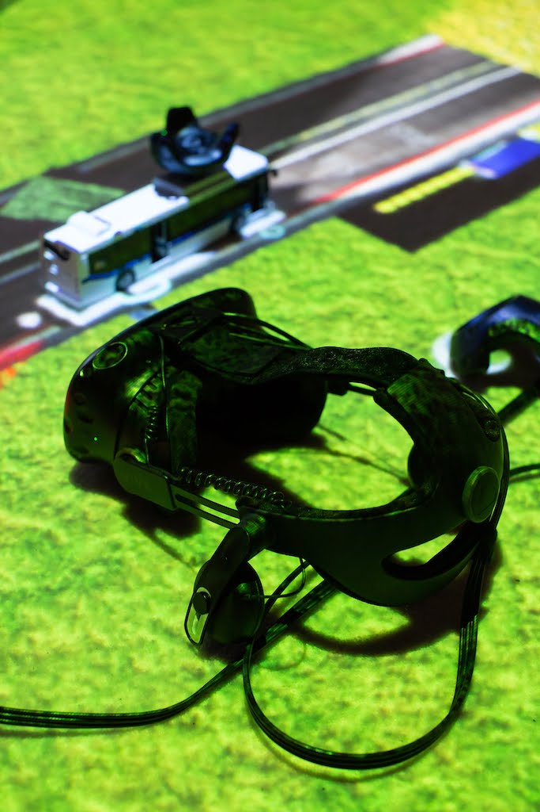
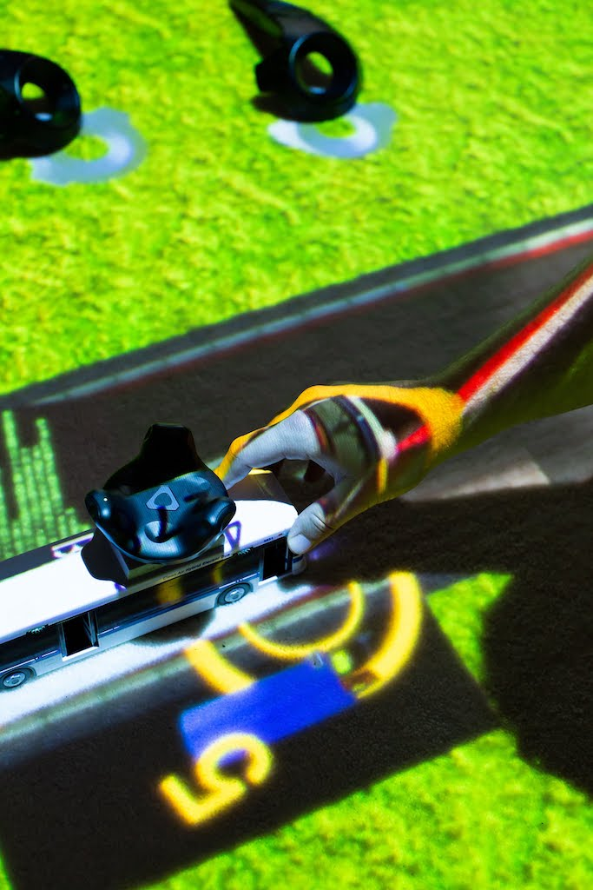
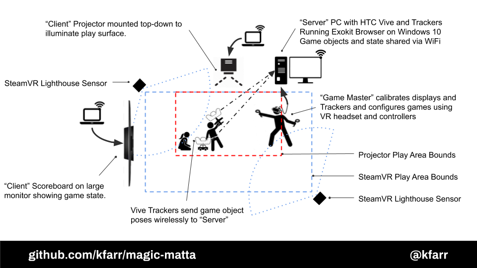
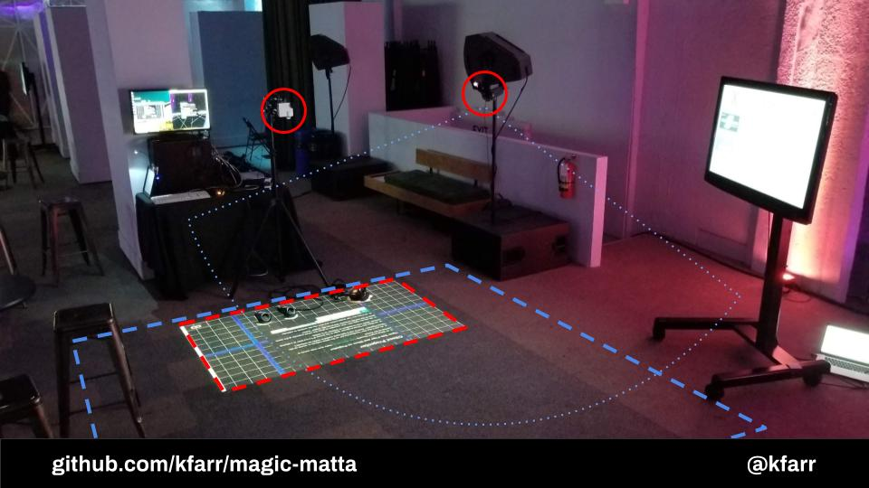
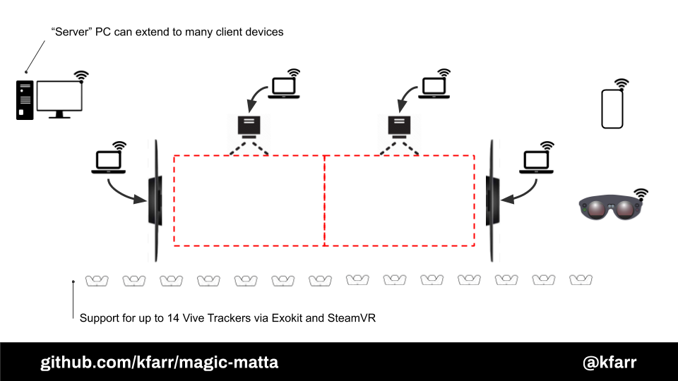

<b>Magic Matta</b> renders "magic carpet" style games and experiences for children (and children at heart) using physical toy "controllers" tracked with HTC Vive Trackers combined with a top-down projector display.

This requires special hardware to run, explained below in detail. This project attempts to use open-source tools such as WebVR and A-Frame where practical. (Why the name? "matta" is swedish for carpet or rug and Magic Carpet is a reserved trademark.) This is a work in progress and does not work easily without significant manual configuration.

## Pictures

Photo Credits: [Mariah Tiffany](http://www.mariahtiffany.com/)

## Who and Why?
This project was [created during the Gray Area Foundation 2019.1 Incubator by Kieran Farr](https://medium.com/@kfarr/creating-magic-matta-for-the-2019-1-gray-area-showcase-37df8f5d8aa0). ([All other model and software credits found here](/docs/CREDITS.md#credits).)

Here is a quick summary of the project motivations:
* Provide a VR experience that kids can see without a headset. Create a fun toy that can also teach things
* Experiment with different input styles -- what can you do with many controllers with no buttons?
* Try to have "multimodal" experience (allow simultaneous headset and projector use with synced scene)
* Uses HTC Vive instead of computer vision for higher accuracy and lower latency of toy tracking making development simpler by ignoring CV complexities

# Project Setup Instructions

## Step 1 - Equipment Requirements and Setup
Let's start with hardware requirements before we get too excited about software setup.

* 1x PC with HTC Vive with system specs capable of supporting modern VR experiences.
* 1x projector mounted about 1.5m off the ground pointing downward at the floor that makes an approximately 6' (2m) diagonal screen projection. (You can get started without this, but it won't be complete without. [A versatile starter option is the Optoma ML750ST micro-projector with 1/4" tripod mounts](https://www.amazon.com/Optoma-ML750ST-Ultra-Compact-Projector-Enabled/dp/B07GWT1MCC) which allows you to mount it with something like [this arm](https://www.amazon.com/Manfrotto-244-Variable-Friction-Bracket/dp/B000J4FONU) and [this clamp](https://www.amazon.com/Manfrotto-035RL-Super-Clamp-Standard/dp/B0018LQVIA/).)
* 2x computers to feed the projector and scoreboard. Any OS, make or model that has an up-to-date OS and browser and can render medium-complexity WebGL scenes at approx 30 frames per second and connect to the same network as the HTC Vive PC. Most computers made since ~2015 will work for this, I use 2015 era MacBooks with no problem.
* 2x [HTC Vive Tracker and Receivers](https://www.amazon.com/VIVE-Virtual-Reality-System-Tracker-pc/dp/B0748ZY323/)
* 2x [Daron brand 1:43 scale NY MTA model bus toy.](https://www.amazon.com/Daron-RT8468-MTA-11-Bus/dp/B00EVQJ5I2)
* 2x [1/4" Tripod Screw Adapter Flash Shoe Mount (normally for DSLR Camera) comes with tightening threads for 1/4"](https://www.amazon.com/gp/product/B018UJLIOE/)
* 1/4" drill bit and drill (or another method to poke a 1/4" diameter hole in the bus toy plastic roof)
* Optional - A reflective bright "screen" on the floor that matches the projected screen size. You can use a white carpet patch or white butcher (large format) paper. You can find carpet "remnants" that work well for this at local carpet stores for as low as $10.
* 1x Big-screen TV or large monitor, separate from projector and HTC Vive PC to serve as a "scoreboard." Really a TV or monitor of any size will do, even just a laptop in a bind.

## Step 2 - Software Installation and Setup
Tested on Windows 10 PC with HTC Vive and Trackers. It's recommended that you run SteamVR Room Setup and set the play zone to match exactly the dimensions of your projector screen area.

Make sure you have installed:
- NodeJS (known good v12.2.0)
- NPM (known good 6.9.0)
- Exokit (known good version was built from source [e5d38a6](https://github.com/exokitxr/exokit/commit/e5d38a6ca5f2c5cc03f79e0b5ec8d0fcad6c142a), but newer versions should work too)
- This repo - clone it!
- Then run `npm install` twice: once in project base directory and once in /server

## Step 3 - Launching and Calibrating
I made a [simple batch file which does some of the below for you](https://github.com/kfarr/magic-matta/blob/master/launch.bat), and you can even link it to a nifty desktop shortcut icon!

1) Open a command prompt in this repo's /server and run: `npm run forever`
2) Navigate back to this repo's root directory and run: `npm start`
3) Note the IP address when you run step #2!
4) Use a text editor to open "/src/scene.html". Update the `url` value on the `broadcast` component on the `a-scene` entity toward the top of the file with the IP address you just noted and append port 12000. The attribute will look something like this: `broadcast="url: http://192.168.1.1:12000"` (TODO: set broadcast url to hostname:12000 via js after scene is loaded)
5) Open another command shell in your exokit [e5d38a6](https://github.com/exokitxr/exokit/commit/e5d38a6ca5f2c5cc03f79e0b5ec8d0fcad6c142a) directory then run: `node . -x webvr http://localhost:3000` (replacing `localhost` with your local IP if necessary)
6) On another machine attached to a projector pointed at the floor, use the IP address noted in (3) and open http://[localip]:3000/ in any browser. Click the Make Projector button on the screen. Use browser Fullscreen to stretch 3d view to full edges. Use the mouse to click, drag and "double drag" (using middle mouse button or two fingers touchpad) to adjust the projector's camera position while using the VR headset and tracked object to manually calibrate the projector.

## Step 4 - Game Play
NOTE: To write

## Step 5 - Mix Your Own Game
NOTE: To write

## How does it work?

## Future ideas
* orthogonal camera instead of perspective, see notes in codebase
* more instructions for calibration
* next button freeze rectangle, then adjust camera position
* feature multiple minigames, switch by shaking controller
* drawing feature (like babypi), start drawing when controller is pointed up like a pen (small end down)
* Vive tracker support for more inputs
* physics minigames (see simple boilerplate project https://glitch.com/edit/#!/boiling-alligator?path=index.html:27:10)
