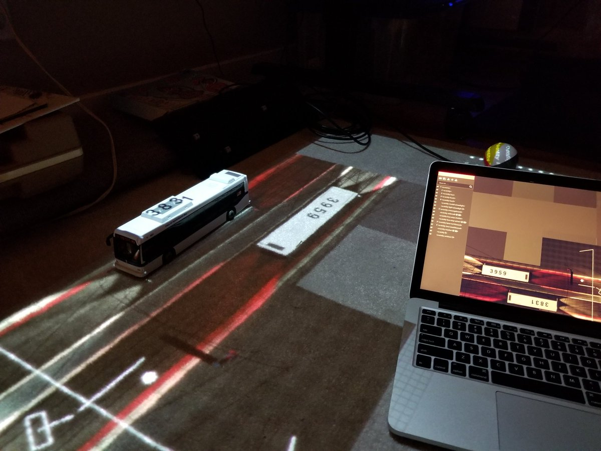
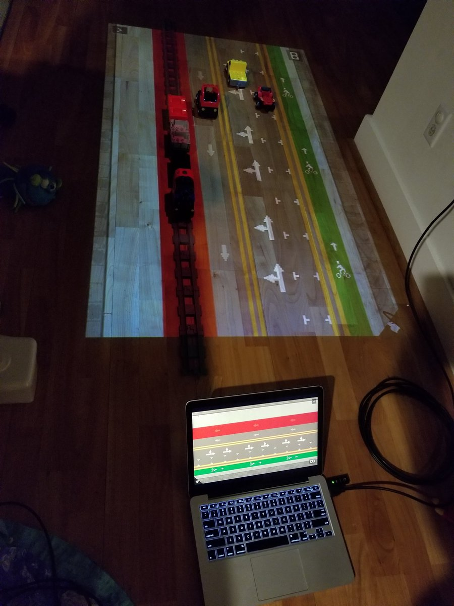
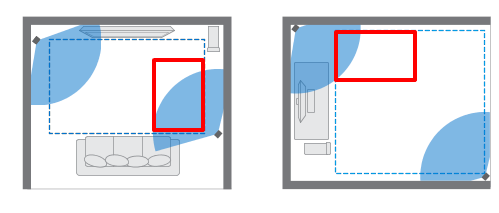

# aframe-matta 🏳️‍🌈
Experiments to create a "magic carpet" type of experience in WebXR using A-Frame and HTC Vive. ("matta" is swedish for carpet or rug) This is a work in progress and does not work easily without significant manual configuration.

## Why?
* XR experience that kids can see without needing headset
* Experimenting with different input styles -- what can you do without buttons?
* Try to have "multimodal" experience (allow simultaneous headset and projector use with synced scene)
* Try to create a fun toy that can also teach things
* HTC Vive instead of computer vision for higher accuracy and lower latency, easier for development to ignore CV complexities

## Work in Progress Examples*
 

*Parts of these examples come from https://github.com/kfarr/aframe-bus and https://github.com/kfarr/streetmix3d. Requires manual configuration.

## What you need
* A PC with HTC Vive
* A projector mounted about 1.5 meters off the ground pointing downward at the floor
* Optional - a separate computer to feed the projector (or can use same Vive PC for this)
* Optional - a white carpet square of the same or slightly larger dimensions than the projector's throw dimensions at mounting height

## Hardware setup instructions
* First choose an area within the HTC Vive lighthouse tracker boundaries for the projector:
 Top-down view: red represents the area of the projected screen. Screen can be anywhere within the lighthouse tracker bounds. It can be any dimensions (portrait or landscape aspect ratio) but make sure it is at a right angle to the lighthouse tracker bounds.

* Mount the projector approx 1.5m off the floor facing down. Most projectors include a 1/4" tripod mount thread (female), you can get clamps with a 1/4" thread (male) to easily mount a mini projector on a table, attach to shelves, etc.
 Side view: suggested mounting heigh of 1.5m, depends on your projector's optics and desired screen size.

* For recommendations on projector and mounting equipment, <a href="https://github.com/chaimgingold/Tabla/#recommended-camera-and-projector">see instructions from La Tabla, another cool projector based XR project</a>

## Software setup instructions
* On a PC with HTC Vive, clone the repo, npm install, npm start
* Use your favorite webvr enabled browser like Firefox or Supermedium to navigate to localhost:8080/server.html
* Use the right Vive controller to position the virtual projector to match the real-life position and press the trigger. 
* On the same or another computer hooked up to the projector, use any browser (webvr support not required) to open [SERVER IP]:8080/client.html
* Press the "init" button and use the on-screen adjustment buttons to tweak the alignment of the projector and the actual controller positions. 
* The bounds of this client projector are now defined.

## Future ideas
* orthogonal camera instead of perspective, see notes in codebase
* more instructions for calibration
* next button freeze rectangle, then adjust camera position
* feature multiple minigames, switch by shaking controller
* drawing feature (like babypi), start drawing when controller is pointed up like a pen (small end down)
* Vive tracker support for more inputs
* physics minigames (see simple boilerplate project https://glitch.com/edit/#!/boiling-alligator?path=index.html:27:10)
